# Баг-репорт по скриншоту

## Критический приоритет (P0)

### [P0-1] При фильтре "Мальчик" показываются объявления с девочками

## Высокий приоритет (P1)

### [P1-1] Неправильный город в тумблере "Сначала из"
  - Ожидаемый результат: 
  - Фактический результат: 

### [P1-2] Отсутствует поле Окрас

### [P1-3]  Неправильная верстка объявлений
  - Ожидаемый результат: 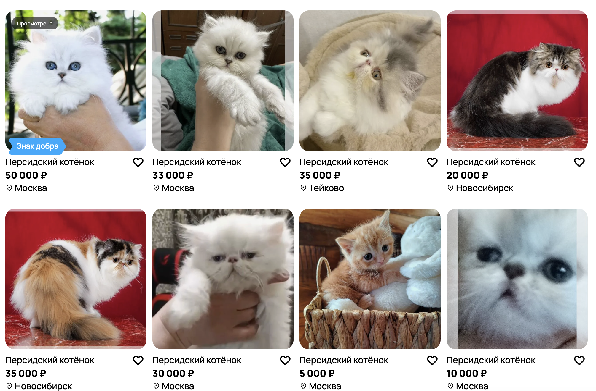
  - Фактический результат: 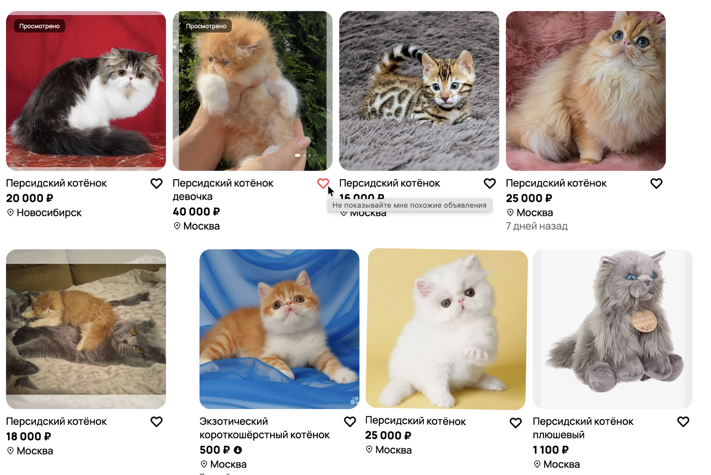

### [P1-4]  При поиске котят выводятся и игрушки

---

## Средний приоритет (P2)

### [P2-1] Текст над "Уведомять о новых" "Ошибка обновите страницу"

### [P2-2] Возраст "Щенок" у котят
  - Ожидаемый результат: 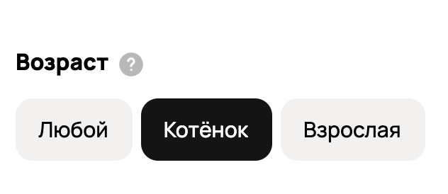
  - Фактический результат: 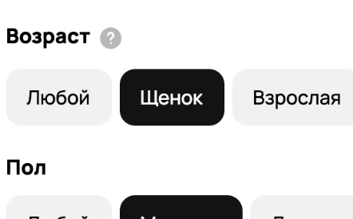

### [P2-3]  Неправильный текст в подсказке "Добавить в избранное"
  - Ожидаемый результат: 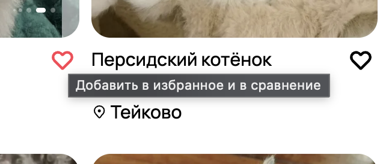
  - Фактический результат: 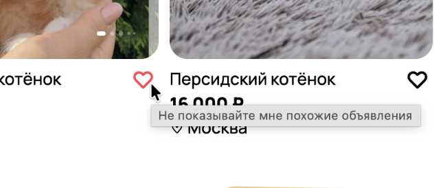

---

## Низкий приоритет (P3)

### [P3-1] Неправильное название в шапке "Коръера в Авито"
  - Ожидаемый результат: 
  - Фактический результат: 

### [P3-2] Неправильные фильтры
  - Ожидаемый результат: 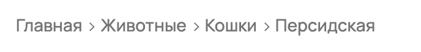
  - Фактический результат: 

### [P3-3] Неправильный текст "Уведомять о новых"
  - Ожидаемый результат: 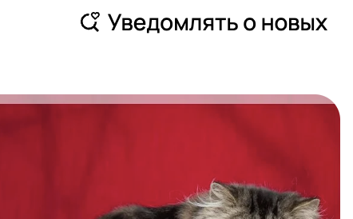
  - Фактический результат: 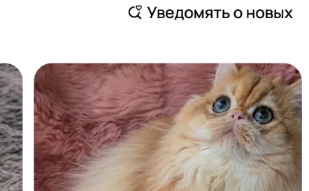

### [P3-4] Отсутствует чекбокс в Породе
  - Ожидаемый результат: 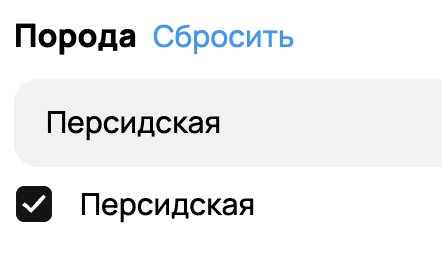
  - Фактический результат: 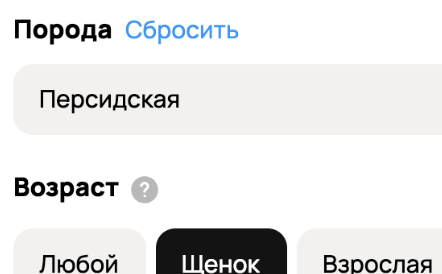
